# Master Project Plan

## 1. Program outcome

At completion, users should be able to install or clone one Forge Studio distribution and receive:

- Forge Studio as the primary UI;
- Forge Neo's original UI as a compatibility option;
- the same model and extension ecosystem;
- accurate diagnostics;
- improved phase-transition latency where safely achievable;
- a documented update and rollback path;
- visible source and license information;
- predictable upstream Neo updates.

## 2. Workstreams

The program has seven parallel workstreams:

| Workstream | Scope |
|---|---|
| Product foundation | Fork, branding, bootstrap, launchers, route ownership |
| Compatibility | Existing Studio behavior, stock Neo UI, extensions, settings migration |
| Architecture | Studio services, Neo adapters, API boundaries, patch inventory |
| Correctness | Output parity, state isolation, interruption, error recovery |
| Performance | Instrumentation, previews, detector cache, Hires/model lifecycle |
| Release engineering | Packaging, updates, provenance, checksums, rollback |
| Maintenance | Upstream merges, regression suite, support matrix, agent handoffs |

## 3. Phase map

```mermaid
flowchart LR
    P0[Phase 0\nCharter and baseline]
    P1[Phase 1\nRepository bootstrap]
    P2[Phase 2\nIntegrated distribution]
    P3[Phase 3\nParity and observability]
    P4[Phase 4\nSafe performance wins]
    P5[Phase 5\nModel session and Hires]
    P6[Phase 6\nPostprocessing lifecycle]
    P7[Phase 7\nPackaging and migration]
    P8[Phase 8\nPublic beta]
    P9[Phase 9\nAdvanced optimization]

    P0 --> P1 --> P2 --> P3 --> P4 --> P5 --> P6 --> P7 --> P8 --> P9
```

Phases may overlap only after their entry criteria are met. Performance work may be researched earlier, but it must not merge ahead of baseline instrumentation and parity gates.

## 4. Phase summary

| Phase | Primary deliverable | Exit gate |
|---|---|---|
| 0 | Frozen source baseline and charter | Exact commits, launch logs, benchmark fixtures |
| 1 | Maintainable fork structure | Upstream remote, branch policy, clean import |
| 2 | Integrated distribution boots | Studio default + stock UI compatibility |
| 3 | Parity, tests, truthful metrics | Repeatable smoke suite and wall-time agreement |
| 4 | Low-risk latency improvements | Measured wins with no output regression |
| 5 | Model-session/Hires policy | Fewer unnecessary swaps and safe restoration |
| 6 | ADetailer/postprocess lifecycle | Detector reuse and nested phase controls |
| 7 | Installer, updater, migration | Clean install/upgrade/rollback tested |
| 8 | Public beta process | Support matrix and sync rehearsal completed |
| 9 | Optional advanced performance | Only benchmark-backed, reversible features |

## 5. Non-negotiable gates

A phase cannot close while any of these are true:

- the exact upstream base is unknown;
- generated output or metadata changes without an intentional, documented requirement;
- the console's reported wall time disagrees materially with external wall time;
- a performance claim compares different server sessions;
- a model-state change can leak into the next request;
- Studio and stock Neo interfaces cannot coexist or be recovered;
- a release cannot be rolled back without deleting user models or settings;
- source/license/credits are inaccessible from the product.

## 6. Initial technical priorities

### First priority: foundation

- record the actual Neo commit;
- create the fork and upstream remote;
- import Studio as a built-in component with minimal edits;
- preserve `/studio`;
- preserve the stock UI;
- create smoke tests and phase tracing.

### Second priority: safe wins

- fix timer boundaries and overlapping metric accounting;
- cache ADetailer detector construction;
- avoid recurring VAE/checkpoint filesystem scans;
- preserve compatible full-latent preview decoding;
- retain preview demand gating and bounded cadence;
- eliminate duplicate route registration and session leakage.

### Third priority: lifecycle improvements

- create a Studio model-session manager;
- distinguish persistent user model selection from temporary phase model;
- support explicit Hires restoration policies;
- avoid restoring a base checkpoint before the result is returned when safe;
- coalesce checkpoint/VAE/text-encoder changes;
- investigate pressure-aware cache clearing with upstream-compatible hooks.

### Later priority: advanced optimization

- previous-model CPU cache;
- model prefetch;
- batch-phase Hires scheduling;
- compatible ADetailer crop batching;
- background restoration;
- architecture-specific Fast preview validation.

## 7. Governance

The project owner approves:

- supported platforms and model families;
- release gates;
- product behavior changes;
- compatibility exceptions;
- use of telemetry or network services;
- whether a risky performance feature graduates from experimental.

Agents may implement and recommend. They do not silently redefine scope or support policy.

## 8. Status reporting cadence

At the end of every work session:

- update `PROJECT_STATE.md`;
- update the relevant phase document;
- record benchmark results and raw log locations;
- commit or explicitly discard local changes;
- identify the next single task;
- note unresolved questions and risks.

At every release candidate:

- generate an upstream diff report;
- produce a patch inventory;
- run the full compatibility matrix;
- perform a clean-install test;
- perform an upgrade test from the prior release;
- perform a rollback test.
