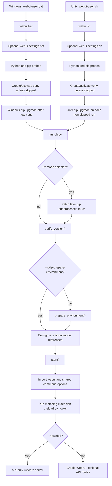

# Phase 0 Launch and Dependency Audit

## Audit identity

- Audit date: `2026-07-23`
- Audit method: static source inspection
- Product commit: `6db89619f5db2c2f97eee097176c09edfb947fdb`
- Branch: `docs/phase0-complete-baseline`
- Application launched: no
- Dependencies installed, upgraded, or downloaded: no
- Local evidence: `../Evidence/phase-0/02-launch-audit/`

Classification used below:

- **Unconditional** — occurs whenever the stated entry path is taken.
- **Conditional** — requires an argument, environment state, missing file or
  package, or another stated branch.
- **Inferred** — supported by the inspected call site but dependent on code
  outside the static audit or on runtime state.

## 1. Launch-chain diagram



Key sources: `webui.bat`, `webui.sh`, `launch.py:main`,
`modules/launch_utils.py:prepare_environment` and `start`,
`modules/shared_cmd_options.py` module initialization, and
`modules/script_loading.py:preload_extensions`.

## 2. Windows launch behavior

| Finding | Source/block | Classification |
|---|---|---|
| `webui-user.bat` clears `COMMANDLINE_ARGS` and calls `webui.bat`. | `webui-user.bat`, top-level | Unconditional for this entry point |
| `webui.settings.bat` is called when present and may set variables or execute arbitrary batch commands. | `webui.bat`, opening block | Conditional |
| Defaults are `PYTHON=python` and `<REPOSITORY>\venv`; `GIT` is also copied to `GIT_PYTHON_GIT_EXECUTABLE` when defined. | `webui.bat`, defaults | Conditional defaults |
| `tmp/` is created and Python/pip probe output is written to `tmp/stdout.txt` and `tmp/stderr.txt`. | `webui.bat`, probe blocks | Unconditional |
| The venv is skipped for `VENV_DIR=-` or `SKIP_VENV=1`; otherwise it is created when its Python is absent. | `webui.bat:start_venv` | Conditional |
| pip is upgraded only on the new-venv path; failure warns and activation continues. | `webui.bat:upgrade_pip` | Conditional |
| `launch.py` receives wrapper arguments through `%*`. | `webui.bat:launch` | Unconditional |
| A `tmp/restart` marker loops back to launch using the selected Python. | `webui.bat:launch` | Conditional |
| Empty captured stderr causes the `show_stderr` label to branch to itself. | `webui.bat:show_stderr` | Conditional; statically verified control-flow defect, runtime impact not tested |

## 3. Unix launch behavior

| Finding | Source/block | Classification |
|---|---|---|
| `webui-user.sh` exports `COMMANDLINE_ARGS="--uv"` and replaces itself with `webui.sh`. | `webui-user.sh`, top-level | Unconditional for this entry point |
| `webui.settings.sh` is sourced when present and may alter the shell or execute arbitrary commands. | `webui.sh`, optional settings | Conditional |
| Defaults are `PYTHON=python3` and `<REPOSITORY>/venv`. | `webui.sh`, defaults | Conditional defaults |
| The same venv skip controls exist as on Windows. | `webui.sh`, venv block | Conditional |
| pip is upgraded on every non-skipped venv path, even when the venv already exists. | `webui.sh`, venv block | Conditional |
| `launch.py` receives wrapper arguments through `"$@"`. | `webui.sh`, launch block | Unconditional |
| A restart marker re-execs the full wrapper, including its pip-upgrade path. | `webui.sh`, restart block | Conditional |
| Because the script uses `set -e`, a nonzero `launch.py` exit may end the wrapper before its later restart and diagnostic blocks. | `webui.sh`, top-level and launch block | Conditional, verified shell consequence |

## 4. Python and virtual-environment selection

`webui.bat` and `webui.sh` select the wrapper interpreter through `PYTHON`.
They create a standard-library venv under `VENV_DIR` unless `VENV_DIR=-` or
`SKIP_VENV=1`. The wrapper then replaces `PYTHON` with the venv interpreter
before invoking `launch.py`.

`modules/launch_utils.py` records `sys.executable` as its Python command.
Consequently, preparation and extension installers use the interpreter that
actually entered `launch.py` (**unconditional after entry**).

`modules/launch_utils.py:check_python_version` expects Python 3.13. A mismatch
prints a warning unless `--skip-python-version-check`; it does not itself abort
the launch (**conditional**).

## 5. Dependency and pip behavior

`modules/launch_utils.py:prepare_environment` performs package work unless
`launch.py:main` sees `--skip-prepare-environment`.

| Behavior | Source/function | Classification |
|---|---|---|
| `run_pip` executes `python -m pip`, adds `--prefer-binary`, and optionally adds `INDEX_URL`. | `modules/launch_utils.py:run_pip` | Conditional on a requested install |
| `run_pip` returns without execution under `--skip-install`. | Same | Conditional |
| Missing `packaging` and Gradio trigger installs using configurable package strings. | `prepare_environment` | Conditional |
| `requirements.txt` is checked before and after extension installers. | `requirements_met`; `prepare_environment` | Conditional install; unconditional checks during preparation |
| The check accepts installed versions greater than pins, ignores unpinned `torch`, and does not fully evaluate requirement syntax. | `requirements_met` | Unconditional algorithm |
| pip itself applies the full manifest when `install -r` runs. | `prepare_environment` call site | Conditional |
| `--skip-version-check` suppresses later runtime warnings only; it does not suppress installs. | `modules/initialize.py:check_versions` | Conditional |

`requirements_versions.txt` and `environment-wsl2.yaml` are absent. No behavior
can be attributed to them.

## 6. PyTorch installation and validation behavior

`modules/launch_utils.py:prepare_environment` defines:

- torch `2.11.0+cu130`;
- torchvision `0.26.0+cu130`;
- default extra index
  `https://download.pytorch.org/whl/cu130`;
- overrides `TORCH_COMMAND` and `TORCH_INDEX_URL`.

Torch and torchvision are installed when either distribution is missing or
`--reinstall-torch` is present (**conditional, verified**). This command uses
`run`, not `run_pip`; therefore `--skip-install` does not prevent it.
`--skip-prepare-environment` does prevent it.

Unless `--skip-torch-cuda-test` is set, a child Python process asserts that
CUDA, XPU, or MPS is available. Failure aborts preparation; errors mentioning
an older driver receive CUDA 13.0 driver guidance (**conditional, verified**).

Later, `modules/errors.py:check_versions` warns when torch is older than
`2.11.0`. `--skip-version-check` skips that warning but not installation or
the GPU test.

## 7. Extension preload and installer behavior

`modules/launch_utils.py:run_extensions_installers` runs `install.py` for
enabled user extensions and enabled built-ins unless `--skip-install`
(**conditional, verified**). Each installer receives the repository on
`PYTHONPATH`; launcher-level exceptions are reported and processing continues.

The current user `extensions/` directory is empty. The only current built-in
installer is
`extensions-builtin/forge_legacy_preprocessors/install.py`. It conditionally
installs ten unpinned packages, insightface, and two configurable GitHub wheel
URLs. It catches per-package failures and continues.

During application import, `modules/shared_cmd_options.py` invokes
`modules/script_loading.py:preload_extensions`:

- enabled user extensions are filtered through `list_extensions`;
- every built-in directory is scanned directly for `preload.py`;
- preload modules are imported and their `preload(parser)` functions run;
- errors are reported and remaining preloads continue.

Current preload files add ControlNet logging and LoRA-directory arguments.
Preload code is not suppressed by `--skip-install` or
`--skip-prepare-environment` (**conditional on reaching application import,
verified**).

## 8. Network-access inventory

| Endpoint or remote | Trigger | Source | Classification |
|---|---|---|---|
| Default pip index or `INDEX_URL` | Any `run_pip` installation | `run_pip` | Conditional |
| PyPI plus PyTorch CUDA wheel index | Torch install/reinstall | `prepare_environment` | Conditional |
| GitHub release assets | Optional SageAttention, FlashAttention, Nunchaku, or legacy preprocessor wheel install | `prepare_environment`; built-in installer | Conditional |
| Azure DevOps ONNX Runtime nightly index | `--onnxruntime-gpu` with package absent | `prepare_environment` | Conditional |
| User-extension Git remotes | `--update-all-extensions` | `git_pull_recursive` | Conditional |
| uv-resolved package sources | uv mode plus pip work | `modules_forge/uv_hook.py:patched_run` | Conditional |
| Gradio share service | `--share` | `webui.py:webui_worker` | Conditional |
| ngrok service | `--ngrok` | `modules/ui.py`; `modules/ngrok.py:connect` | Conditional |

When neither `--share` nor `--listen` is selected,
`modules/ui.py` disables Gradio's version check and forces local-IP discovery
to `127.0.0.1` (**verified**). Potential Gradio version-check traffic in share
or listen mode is **inferred** from that source comment and dependency
behavior.

No launcher-level network retry loop was found.

## 9. Files and directories that may be created or modified

| Target | Source | Classification |
|---|---|---|
| `tmp/`, `tmp/stdout.txt`, `tmp/stderr.txt` | Both wrappers | Unconditional wrapper mutation |
| `venv/` or overridden `VENV_DIR` | Wrapper venv blocks | Conditional |
| venv packages and pip/uv caches | Wrapper upgrade and preparation installs | Conditional |
| `config.json` or overridden UI settings file | `verify_version` | Conditional when absent |
| `tmp/config.json` | `list_extensions` recovery | Conditional on settings-load failure reaching that block |
| `tmp/restart` removal | `prepare_environment` | Conditional |
| `.uv-cache/` | `uv_hook._set_cache` | Conditional |
| User extension Git worktrees | `git_pull_recursive` | Conditional |
| `sysinfo-*.json` | `dump_sysinfo` | Conditional |
| ControlNet, preprocessor, and diffusers model directories | `modules_forge/shared.py` module initialization | Conditional on runtime import |
| Arbitrary extension-defined targets | Installer and preload execution | Conditional/inferred per extension |

`ui-config.json` is a configured default path in `modules/cmd_args.py`; its
actual creation was not established in the approved launch blocks.

## 10. Command-line and environment-variable inputs

Command-line arguments come from:

1. wrapper arguments (`%*` or `"$@"`);
2. `COMMANDLINE_ARGS`, appended with `shlex.split` by
   `modules/paths_internal.py`;
3. optional settings scripts that can alter environment variables;
4. extension preload functions that add parser options;
5. model-reference functions that append discovered paths to `sys.argv`.

Relevant consumed variables include:

```text
PYTHON
GIT
GIT_PYTHON_GIT_EXECUTABLE
VENV_DIR
SKIP_VENV
COMMANDLINE_ARGS
SD_WEBUI_RESTART
ERROR_REPORTING
INDEX_URL
WEBUI_LAUNCH_LIVE_OUTPUT
TORCH_INDEX_URL
TORCH_COMMAND
XFORMERS_PACKAGE
BNB_PACKAGE
PACKAGING_PACKAGE
GRADIO_PACKAGE
REQS_FILE
PYTORCH_VERSION
SAGE_PACKAGE
FLASH_PACKAGE
TRITION_PACKAGE
NUNCHAKU_PACKAGE
ONNX_PACKAGE
DEPTH_ANYTHING_WHEEL
DEPTH_ANYTHING_V2_WHEEL
IGNORE_CMD_ARGS_ERRORS
PYTHONPATH
UV_CACHE_DIR
SD_WEBUI_RESTARTING
GRADIO_ANALYTICS_ENABLED
COVERAGE_RUN
CUDA_VISIBLE_DEVICES
```

`TRITION_PACKAGE` is the exact spelling consumed by the source. Some entries
are set for downstream tools rather than read back by the launcher itself.

## 11. Localhost, API, listen, and share exposure behavior

- `--listen` selects `0.0.0.0`; `--server-name` takes precedence
  (**conditional, verified**).
- With neither option, the code passes `None` to Gradio/Uvicorn. Effective
  loopback binding is expected from the server dependency but remains a
  runtime-verification item (**inferred**).
- `--share` requests a Gradio public share URL (**conditional, verified**).
- `--ngrok` opens an outbound tunnel to local port 7860 unless `--port` is
  supplied (**conditional, verified**).
- `--api` adds API routes to the Web UI server; `--nowebui` starts API-only
  Uvicorn, defaulting to port 7861 (**conditional, verified**).
- `--api-auth` and Gradio authentication are optional and absent by default.
- `--api-server-stop` conditionally exposes stop/restart/kill operations.
- Any share, listen, ngrok, or explicit server-name mode marks the UI
  non-local and disables extension access unless
  `--enable-insecure-extension-access` is set.
- The Web UI enables `/docs` and `/redoc`.
- Gradio allowed paths include the configured `data_path` root by default plus
  the Forge canvas JavaScript directory.

`--nowebui --ngrok` without `--port` appears to tunnel 7860 while API-only
uses 7861; effective behavior is inconclusive until runtime testing.

## 12. Failure, retry, and recovery behavior

- Wrapper Python, pip, and venv failures stop launch and use captured logs.
- pip-upgrade failure is nonfatal in both wrappers.
- `modules.launch_utils.run` raises with the command, exit code, and captured
  output; it has no explicit retry.
- Optional acceleration installers catch several failures and continue, while
  torch, requirements, Gradio, xformers, ngrok-package, and ONNX paths can
  abort preparation.
- Extension installer errors are reported and processing continues.
- Extension Git pull errors are reported per repository and processing
  continues.
- uv absence causes a prompt and exit; uv is not installed automatically.
- A missing settings file is created with `VERSION_UID=PY313`. A differing UID
  causes an interactive clean-reinstall warning.
- `list_extensions` can move a corrupt settings file to `tmp/config.json`, but
  the earlier `verify_version` JSON load can fail before that recovery is
  reached.
- Invalid TLS paths are printed, but simple nonexistence does not clear the
  values in `validate_tls_options`; downstream failure remains possible.
- Web UI stop and reload are handled in-process. Wrapper restart uses
  `tmp/restart`.

## 13. Privacy and security observations

- `modules.launch_utils.py:start` prints all launch arguments. Tokens,
  usernames, passwords, and private paths supplied on the command line can
  enter logs.
- `modules/ngrok.py:connect` prints the token when connection fails.
- `modules.launch_utils.py:run` includes the full failed command in errors;
  credentials embedded in package URLs can enter logs.
- Optional settings scripts and extension installer/preload files execute
  code and must be trusted.
- `--skip-install` does not prevent preload execution and does not prevent the
  direct torch install branch.
- The Web UI removes Gradio's existing broad CORS middleware, then installs
  middleware driven by explicit CORS arguments. Permissive origin arguments
  broaden access.
- Non-local mode protects extension management by default, but
  `--enable-insecure-extension-access` overrides that protection.
- No credential, private path, model name, prompt, or generated output was
  retained in this audit.

## 14. Conditions required for a safe first launch

1. Use a verified Python 3.13 interpreter and a deliberately selected
   environment.
2. Decide whether venv creation, wrapper pip upgrade, package installation,
   cache writes, and network access are authorized.
3. `--skip-prepare-environment` suppresses launcher-managed environment
   preparation, but does not guarantee that the existing environment is
   complete, compatible, or runnable. Use it only with a deliberately
   pre-provisioned and verified environment; `--skip-install` alone is
   insufficient.
4. Account separately for wrapper pip upgrades—especially Unix, where the
   upgrade runs on every non-skipped venv path.
5. Review and trust settings scripts plus every installer and preload source.
6. Keep `--update-all-extensions` disabled during the baseline launch.
7. Keep `--listen`, `--share`, `--ngrok`, and `--server-name` disabled for a
   local-only launch; confirm the actual bind address at runtime.
8. Avoid command-line credentials and credentials embedded in package URLs.
9. Pre-create or back up the settings file and understand expected `tmp/`,
   venv, cache, config, and model-directory mutations.
10. Capture and sanitize the first launch log before retaining it.

## 15. Unknowns and items requiring runtime verification

- Effective default bind address and selected Web UI port.
- Actual first-launch package plan in the intended Forge environment.
- Whether every installed package satisfies runtime compatibility despite the
  launcher's simplified requirement check.
- Effective uv behavior, cache location, and link mode on the target machine.
- Gradio share and version-check network behavior.
- `--nowebui --ngrok` default-port mismatch behavior.
- Actual TLS failure behavior for nonexistent certificate paths.
- Runtime-created configuration files beyond `config.json`.
- Package-manager caches outside the repository.
- Network or file mutations performed by dependencies, runtime model setup,
  or future extensions outside the inspected launch blocks.
- Whether preload and installer behavior changes once user extensions are
  present and settings contain disabled-extension state.
